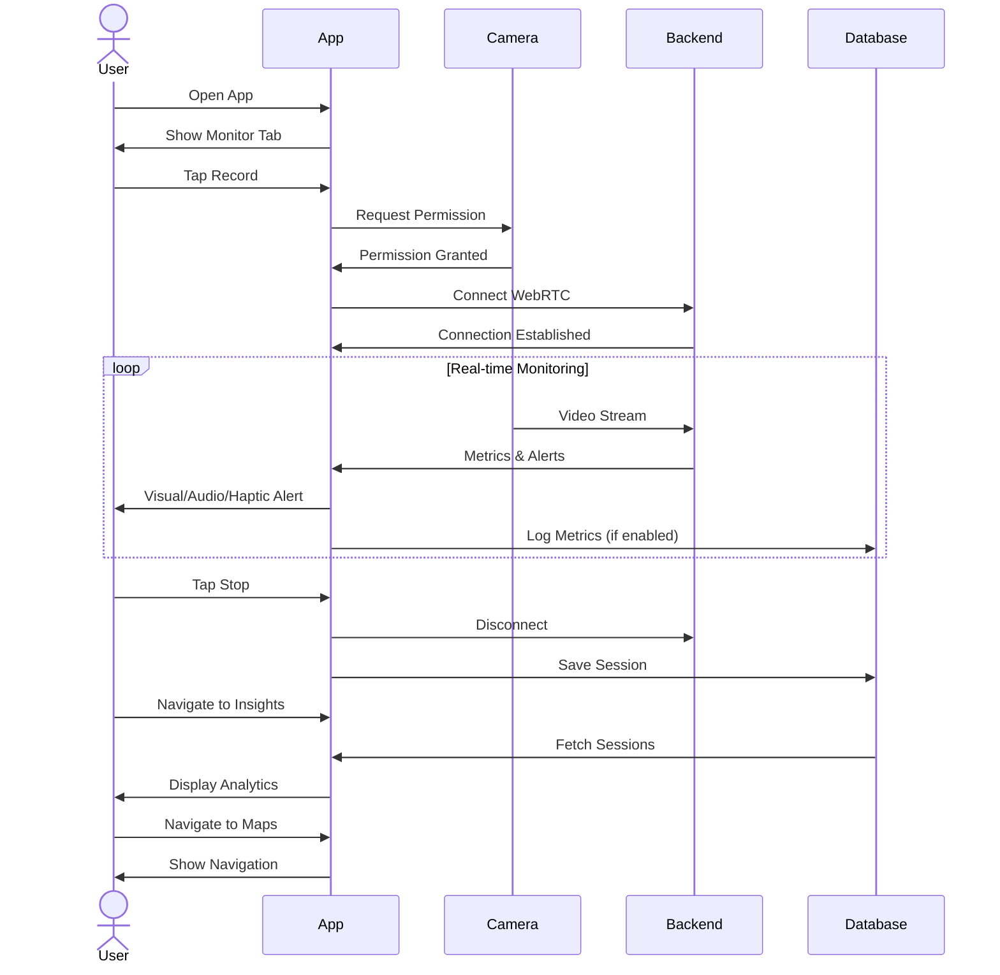

# User Flow

```mermaid
sequenceDiagram
    actor User
    participant App
    participant Camera
    participant Backend
    participant Database
    User->>App: Open App
    App->>User: Show Monitor Tab
    User->>App: Tap Record
    App->>Camera: Request Permission
    Camera->>App: Permission Granted
    App->>Backend: Connect WebRTC
    Backend->>App: Connection Established
    loop Real-time Monitoring
        Camera->>Backend: Video Stream
        Backend->>App: Metrics & Alerts
        App->>User: Visual/Audio/Haptic Alert
        App->>Database: Log Metrics (if enabled)
    end
    User->>App: Tap Stop
    App->>Backend: Disconnect
    App->>Database: Save Session
    User->>App: Navigate to Insights
    Database->>App: Fetch Sessions
    App->>User: Display Analytics
    User->>App: Navigate to Maps
    App->>User: Show Navigation
```
