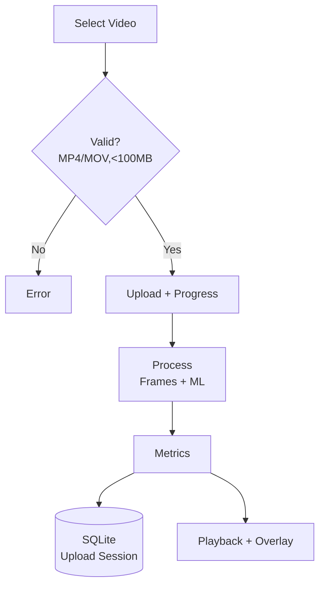

# Video Uploads

## Basic Flow

```mermaid
graph TD
    Select[Select Video] --> Check{Valid?<br/>MP4/MOV,<100MB}

    Check -->|No| Error[Error]
    Check -->|Yes| Uploading[Upload + Progress]

    Uploading --> Process[Process<br/>Frames + ML]
    Process --> Results[Metrics]

    Results --> DB[(SQLite<br/>Upload Session)]

    Results --> Playback[Playback + Overlay]
```
